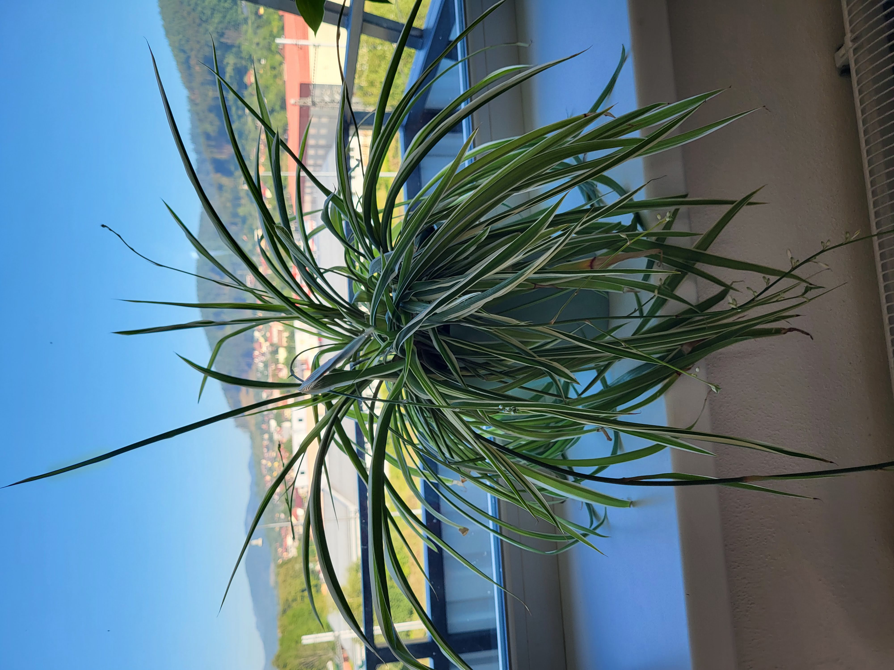

# Zelenec chochlatý

## Pestovanie

### Umiestnenie

Od skorej jari do jesene na jasnom filtrovanom svetle, v zime na priame
slnečné svetlo.

### Zemina

Vhodný je bežný hlinitý substrát.

### Zálievka

Na jar a v lete udržovať zeminu stále vlhkú, v zime zálievku zmierniť.

### Vlhkosť vzduchu

Rastilina uprednostňuje vyššiu vlhkosť vzduchu.

### Hnojenie

Od jari do jesene, bežné hnojivo pre izbové rastliny.

## Rozmnožovanie

Rozmnoženie pomocou dcérskych výhonkov, keď už majú vyvinuté korene.
Oddelenú rastlinu vložiť do vody/pôdy.

